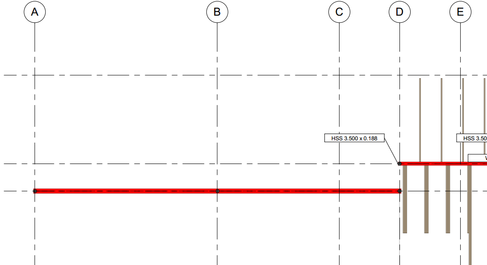
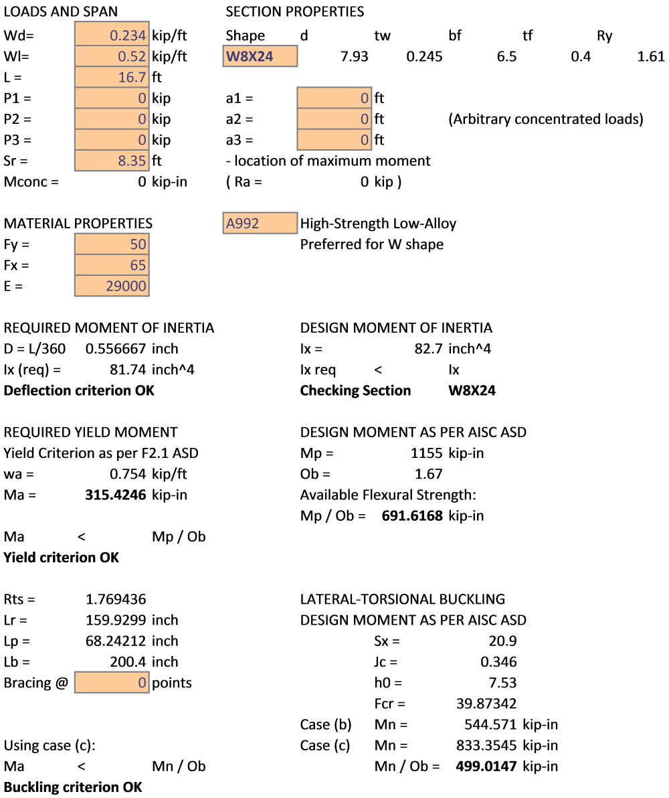

# 1. Sketch.

# 2. Input Summary.

## 2.1. Applicable codes.  
2.1.1. Wisconsin Administrative Code, Chapter SPS 321 – Uniform Dwelling Code  
2.1.2. ASCE 07-05, Minimum Loads on Buildings  
2.1.3. AISC 360-05, Specification for Structural Steel Buildings  
  
  
## 2.2. Design considerations.

As per 2.1.1, allowable stress design (ASD) is performed for steel elements using 2.1.3.

## 2.3. Load values

### Dead Load Calculation:

Minimum value:                 Dmin = 10 psf;

Dead Load, Roof:

    Minimum value:                 Dmin = 10 psf;
    Flooring: Wood Joists w/ Wood flooring     D1 = approx. 12 psf;
    Walls: light-frame wood walls        D2 = approx 6 psf;
    Max D1+D2 & Dmin            **D = D1+D2 = 18 psf**

### Live Load Calculation:

**L** = 40 psf        as per WAC Chapter SPS 321 Table 321.02

**D** = 18 psf        
**L** = 40 psf        

## 2.4. Load calculation

    Load span 1 = 6'

    Load span 2 = 7'

    Load length = 16.7'

    Load area = (6+7)*16.7 = 217.1 sq.ft.

    D = 18 * 13 = 0.234 kip/ft

    L = 40 * 13 = 0.520 kip/ft

## 3. Structural Design.

    Initial material:    A99 Steel ASTM.

    Beam span = 16.7'

AISC Check

    ASD Design as per 2.1.1. SPS

Section        = **W8X24**

    All considered sections are compact, Y and LBW checks apply.

Unbraced beam at (C):  = A992 Steel, W Shape **W8X24** (see Calculation)

## Calculation

