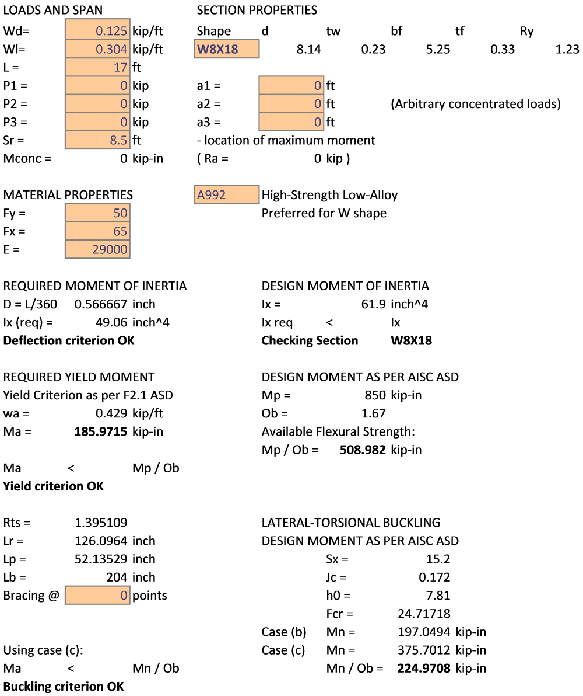

# 1. Sketch.

# 2. Input Summary.

## 2.1. Applicable codes.  
2.1.1. Wisconsin Administrative Code, Chapter SPS 321 – Uniform Dwelling Code  
2.1.2. ASCE 07-05, Minimum Loads on Buildings  
2.1.3. AISC 360-05, Specification for Structural Steel Buildings  
  
  
## 2.2. Design considerations.

As per 2.1.1, allowable stress design (ASD) is performed for steel elements using 2.1.3.

## 2.3. Load values

### Dead Load Calculation:

Minimum value:                 Dmin = 10 psf;

Dead Load, Roof:

Minimum value:          Dmin = 10 psf;

Rafters                 D1 = 3 psf;

Plywood & sheathing     D2 = 3psf/inch * 0.75 = 2.25 psf

Roofing                 D3 = 2 psf

Max D1+D2+D3 & Dmin     **D = 10 psf**

### Dead Load Calculation:

Snow Load				= **24.3 psf** per calculation

**D** = 10 psf        
**L** = 24.3 psf        

## 2.4. Load calculation

    Load span 1 = 2.5'

    Load span 2 = 10.0'

    Load length = 20.58'

    Load area = 12.5 * 20.58 = 257.3 sq.ft.

    D = 10 * 12.5 = 0.125 kip/ft

    L = 24.3 * 12.5 = 0.304 kip/ft

## 3. Structural Design.

    Initial material:    A99 Steel ASTM.

    Beam span = 17.0'

AISC Check

    ASD Design as per 2.1.1. SPS

Section        = **W8X18**

    All considered sections are compact, Y and LBW checks apply.

Unbraced beam at (C):  = A992 Steel, W Shape **W8X18** (see Calculation)

## Calculation

