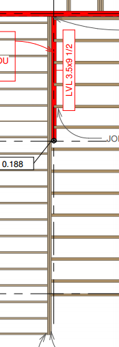

# 1. Sketch.

# 2. Input Summary.

## 2.1. Applicable codes.  
2.1.1. Wisconsin Administrative Code, Chapter SPS 321 – Uniform Dwelling Code  
2.1.2. ASCE 07-05, Minimum Loads on Buildings  
2.1.3. AISC 360-05, Specification for Structural Steel Buildings  
  
  
## 2.2. Design considerations.

Span tables are used to determine minimal section.

Reference design: Weyerhaeuser Microllam LVL Beams p.14-15

<http://www.woodbywy.com/document/TJ-9000/>

## 2.3. Load values

Dead Load Calculation:

Minimum value:                 Dmin = 10 psf;

Flooring: Wood Joists w/ Wood flooring     D1 = approx. 12 psf;

Walls: light-frame wood walls        D2 = approx 6 psf

Max D1+D2+D3 & Dmin            **D = D1+D2 = 18 psf**

**D** = 18 psf        as per WAC Chapter SPS 321, calculation  
**L** = 40 psf        as per WAC Chapter SPS 321 Table 321.02

## 3. Structural Design.

    Load Span 1 = 10.67'

    Load Span 2 = 17.0'

    Beam Span = 8.67'

## 4. Design Results

Floor 2 – Beam at grid (E):

Minimum design section 3.5" x 9.5"