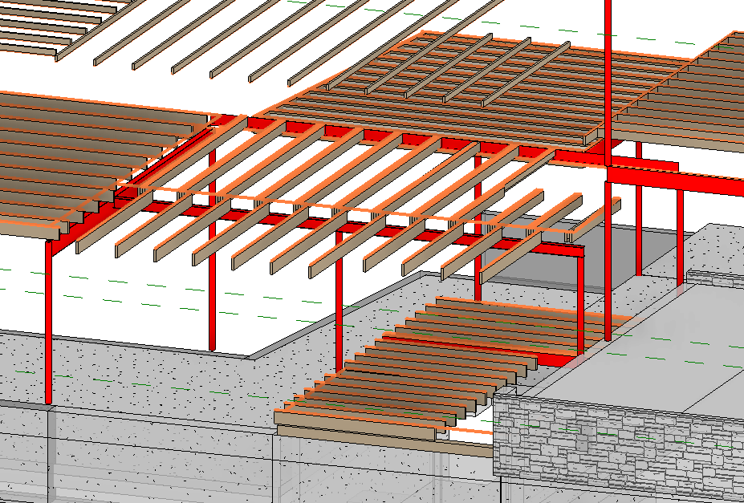
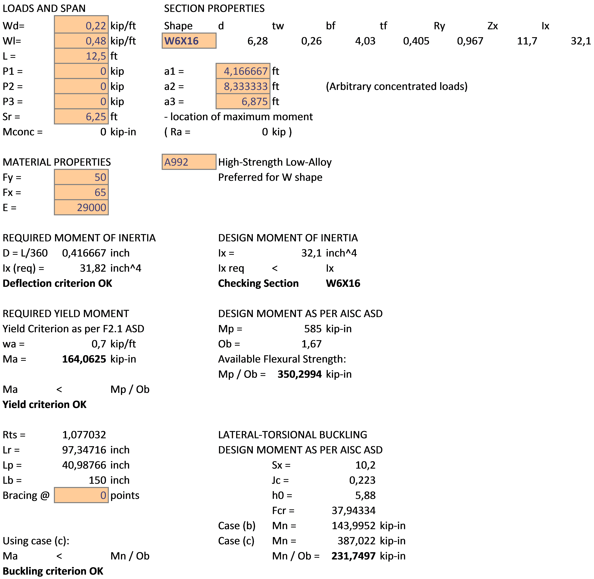
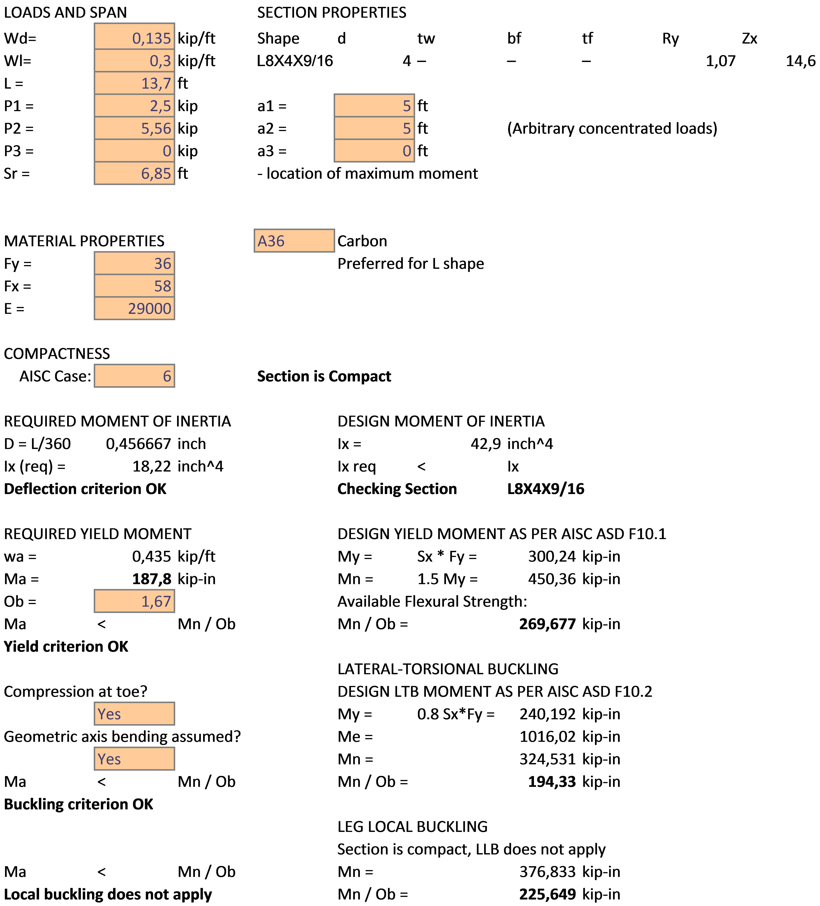
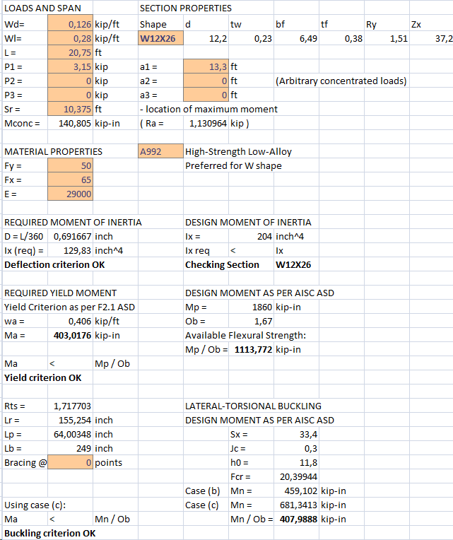

**1. Sketch.**

**2. Input Summary.**

2.1. Applicable codes.  
2.1.1. Wisconsin Administrative Code, Chapter SPS 321 – Uniform Dwelling Code  
2.1.2. ASCE 07-05, Minimum Loads on Buildings  
2.1.3. AISC 360-05, Specification for Structural Steel Buildings  
  
  
2.2. Design considerations.

As per 2.1.1, allowable stress design (ASD) is performed for steel elements using 2.1.3.

2.3. Load values

Dead Load Calculation:

Minimum value:                 Dmin = 10 psf;

Flooring: Wood Joists w/ Wood flooring     D1 = approx. 12 psf;

Walls: light-frame wood walls        D2 = approx 6 psf

Max D1+D2+D3 & Dmin            **D = D1+D2 = 18 psf**

Snow Load				= **15.9 psf**

**D** = 18 psf        as per WAC Chapter SPS 321, calculation  
**L** = 40 psf        as per WAC Chapter SPS 321 Table 321.02

**3. Structural Design.**

3.1. Floor 2, Central Beam Design – Beam at grid (2).

3.1.1 Span 1

    Initial material:    A99 Steel ASTM.

    Span = 12.5'

    Length = 24.4'

Loads Calculation

    Load Area         = 12.5 x 12 = 150 sf.

    Dead Load         = 150 x 18 / 12.5 = 216 pf = 0.22 kip/ft

    Live Load        = 150 x 40 /12.5 = 480 pf = 0.48 kip/ft

AISC Check

    ASD Design as per 2.1.1. SPS

Section        = **W6X16**

    Fy            = 50 ksi

    Fu            = 65 ksi

    All considered sections are compact, Y and LBW checks apply.

3.1.2 Span 2

    Initial material:    A99 Steel ASTM.

    Span = 11.7'

    Length = 24.4'

Loads Calculation

    Load Area         = 11.7 x 12 = 140.4 sf.

    Dead Load         = Wd = 140.4 x 18 / 11.7 = 216 pf = 0.22 kip/ft

Not a governing span – design as per 3.1.1. Calculations not required.

3.2.1 Floor 2, Lintel Beam Design – Beam at grid (4), uniform load + conc. load

    Initial material:    A36 Steel ASTM.

    Span = 12'

    Length = 24'

Loads Calculation

    Span 1:

Load Area         	= 12 x 7.5 	= 90 sf.
Roof/ceiling load span 		 	= 12 ft.

    Dead Load 1        		= 90 x 18 / 12 = 135 pf = 0.135 kip/ft

	Dead Load, Roof:
	Minimum value: 			Dmin = 10 psf;
	Rafters 				D1 = 3 psf;
	Plywood & sheathing 	D2 = 3psf/inch * 0.75 = 2.25 psf
	Roofing				    D3 = 2 psf
	Max D1+D2+D3 & Dmin		D = 10 psf

	Dead Load, Ceiling:		D1 (wood joists) 	= 0.85 psf
							D2 (gypsum 5/8")	= 2.75 psf
							D = D1 + D2 		= 3.6 psf
	Dead Load 2 			= (10 + 3.6) * 12 	= 0.163 kip/ft

	Snow Load Area:			2/5 of roof area

    Live Load        	= 90 x 40 /12 = 300 pf 	= 0.3 kip/ft
    Snow Load 			= 15.9 * 12 * 2/5 		= 0.076 kip/ft

    Span 2:

    Load Area 1        = 7.4 x 7.5 = 55.5 sf

    Load Area 2 (point)    = 10.7 x 13 = 139 sf

    Dead Load        = 55.5 x 18 / 12 = 0.083 kip/ft

    Live Load        = 55.5 x 40 / 12 = 0.185 kip/ft

    Point Dead Load    = 139 x 18 = 2.5 kip

    Point Live Load    = 139 x 40 = 5.56 kip

AISC Check

    ASD Design as per 2.1.1. SPS

    Initial section        = L6X4X9/16

    Fy            = 36 ksi

    Fu            = 58 ksi

    Y, LBW, LLB checks apply.

3.3.1 Floor 2, Beam at grid (H), uniform load + conc. load

    Initial material:    A99 Steel ASTM.

    Span = 20.75'

    Length = 20.75'

Loads Calculation

    Distr. Load Area        = 20.75 x 7 = 145.25 sf.

    Dead Load    		    = 145.25 x 18 / 20.75 = 126 pf = 0.126 kip/ft

    Live Load  		      	= 145.25 x 40 / 20.75 = 280 pf = 0.28 kip/ft

    Conc. load from 3.1.1	= 3wl/8 = 3 * 0.7 * 12 / 8 = 3.15 kip

AISC Check

    ASD Design as per 2.1.1. SPS

Section        = **W12X26**

    Fy            = 50 ksi

    Fu            = 65 ksi

    All considered sections are compact, Y and LBW checks apply.

**4. Design Results**

   

4.1.1 Floor 2, Central Beam Design – Beam at grid (3).

Unbraced:                 = A992 Steel, W Shape **W6X16** (see Calculation 3.1.1.)

4.2. Floor 2, Lintel Beam Design – Beam at grid (4).  

Unbraced:                 = A36 Steel, L Shape **L8X6X3/4** (see Calculation 3.2.)

4.3. Floor 2, Main Beam Design – Beam at grid (H).  

Unbraced:                 = A992 Steel, W Shape **W12X26** (see Calculation 3.3.)

**Calculation 3.1.1.**

**Calculation 3.2.**

**Calculation 3.3.**

