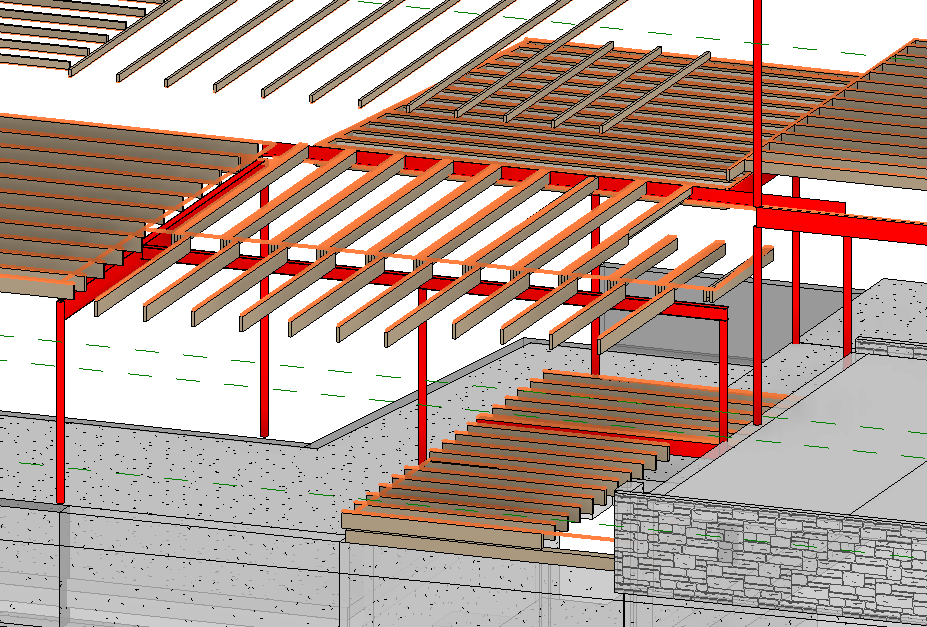

**Column Analysis. Columns at Axis 3, Axis 7**

**1. Sketch.**

**2. Input Summary.**

2.1. Applicable codes.
2.1.1. Wisconsin Administrative Code, Chapter SPS 321 – Uniform Dwelling Code
2.1.2. ASCE 07-05, Minimum Loads on Buildings
2.1.3. AISC 360-05, Specification for Structural Steel Buildings

2.2. Design considerations.
As per 2.1.1, allowable stress design (ASD) is performed for steel elements using 2.1.3.

2.3. Load values

Dead Load Calculation:
Minimum value: 							Dmin = 10 psf;
Flooring: Wood Joists w/ Wood flooring 	D1 = approx. 12 psf;
Walls: light-frame wood walls			D2 = approx 6 psf
Max D1+D2+D3 & Dmin						D = D1+D2 = 18 psf

D = 18 psf		as per WAC Chapter SPS 321, calculation
L = 40 psf		as per WAC Chapter SPS 321 Table 321.02

**3. Structural Design.**

3.1 Columns at gridline (4).

3.1.1. Column at gridline (4D)

	Material 		= A500 Steel ASTM.
	Unbraced length = 7.58'

Loads Calculation from Beams-Central reactions calc (3.2.1):

	Total Point Load 	= R1 = 4.57 kip
	Dead Load 			= 1.4 		kip
	Live Load			= 3.17 		kip

ASD Design as per 2.1.1. SPS 

	Section		= HSS3.5X.188
	Fy			= 42 ksi
	Fu			= 58 ksi
	Compression/buckling checks apply.

3.1.2. Column at gridline (4F)

	Material 		= A500 Steel ASTM.
	Unbraced length = 7.58'

Loads Calculation from Beams-Central reactions calc (R2 from 3.2.1):

	Total Point Load 	= R2 	= 13.84 	kip
	Dead Load 					= 4.33 		kip
	Live Load					= 9.51 		kip

ASD Design as per 2.1.1. SPS 

	Section		= HSS3.5X.188
	Fy			= 42 ksi
	Fu			= 58 ksi
	Compression/buckling checks apply.

3.1.3. Column at gridline (4H)

	Material 		= A500 Steel ASTM.
	Unbraced length = 9.9'

Loads Calculation from Beams-Central reactions calc (R3 from 3.2.1, R2 from 3.3.1):

	Total Point Load 	= R3 +R2	= 3.67+5.33 = 9.0 	kip
	Dead Load 									= 2.8 	kip
	Live Load									= 6.2 	kip

ASD Design as per 2.1.1. SPS 

	Section		= HSS3.5X.188
	Fy			= 42 ksi
	Fu			= 58 ksi
	Compression/buckling checks apply.

3.2. Columns at gridline (2).

Material:	A500 Steel ASTM.

	Unbraced length = 11.3’

Loads Calculation (worst case)

	Load Area 		= 14 x 8 = 112 sf.
	Dead Load 		= 112 x 18 = 2.1 kip
	Live Load		= 112 x 40= 4.5 kip

ASD Design as per 2.1.1. SPS 

Section		= HSS3.5X.188

	Fy			= 42 ksi
	Fu			= 58 ksi
	Compression/buckling checks apply.

**4. Design Results**
	
4.1 Columns at gridline (4).

Unbraced: 		= A500 Gr. B Steel, HSS Shape HSS3.5X.188 (see Calculation 3.1.)

4.2. Columns at gridline (2).

Unbraced: 		= A500 Gr. B Steel, HSS Shape HSS3.5X.188 (see Calculation 3.2.)

 
Calculation 3.1.

Only governing calculation for columns (4F) and (4H) are shown

Calculation 3.2.
 
